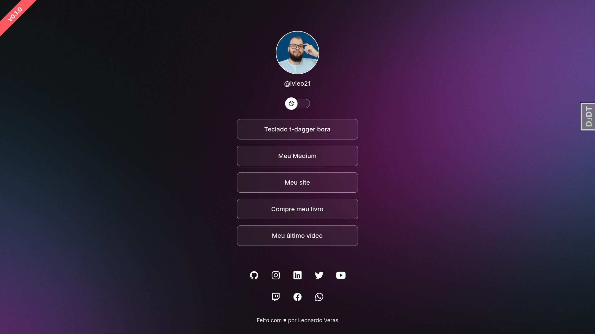
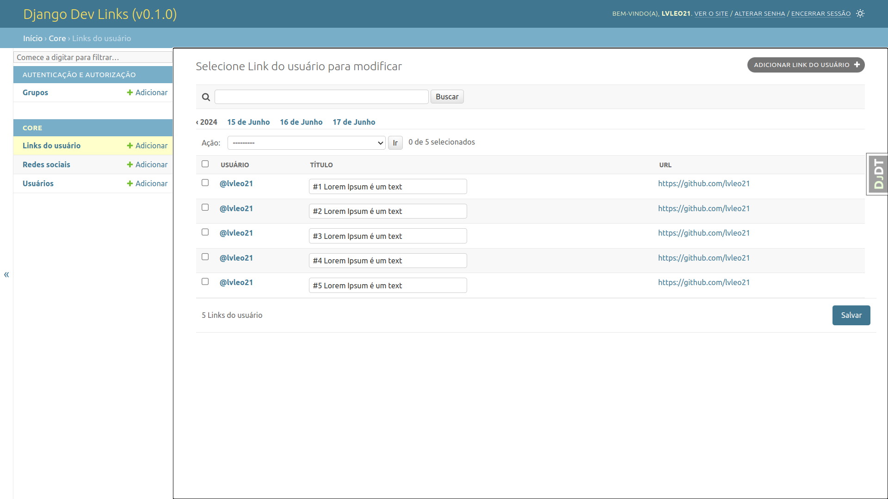
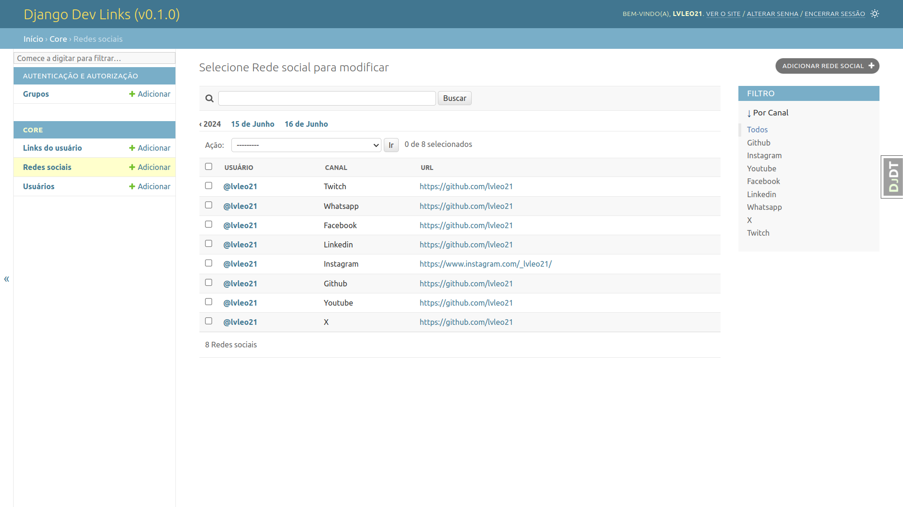
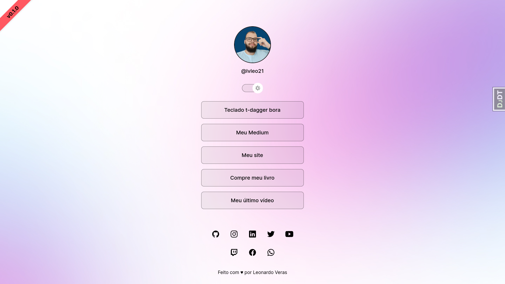

<h1 align="center"> Django DevLinks </h1>

Este projeto é um agregador de links desenvolvido durante o curso Discover da Rocketseat. O objetivo deste projeto é criar uma aplicação simples e eficiente para organizar e compartilhar links de forma prática.

  <a href="#-tecnologias">Tecnologias</a>&nbsp;&nbsp;&nbsp;|&nbsp;&nbsp;&nbsp;
  <a href="#-projeto">Projeto</a>&nbsp;&nbsp;&nbsp;|&nbsp;&nbsp;&nbsp;
  <a href="#-layout">Layout</a>&nbsp;&nbsp;&nbsp;|&nbsp;&nbsp;&nbsp;
  <a href="#memo-licença">Licença</a>

  

 

## 🚀 Tecnologias

Esse projeto foi desenvolvido com as seguintes tecnologias:

- HTML, CSS e JavaScript
- Pyhone e Django
- PostgreSQL

## 💻 Projeto

O Django DevLinks é um agregador de links para usar como cartão de visitas online.

- Cadastro dos links através do painel administrativo do django.

- Cadastro das redes sociais através do painel administrativo do django.

- Django DevLinks com tema "Dark"

- Django DevLinks com tema "Light"

## 🔖 Layout

Você pode visualizar o layout do projeto através [DESSE LINK](https://www.figma.com/community/file/1187422022288947321). É necessário ter conta no [Figma](https://figma.com) para acessá-lo.

## 📝 Licença

Esse projeto está sob a licença MIT.
